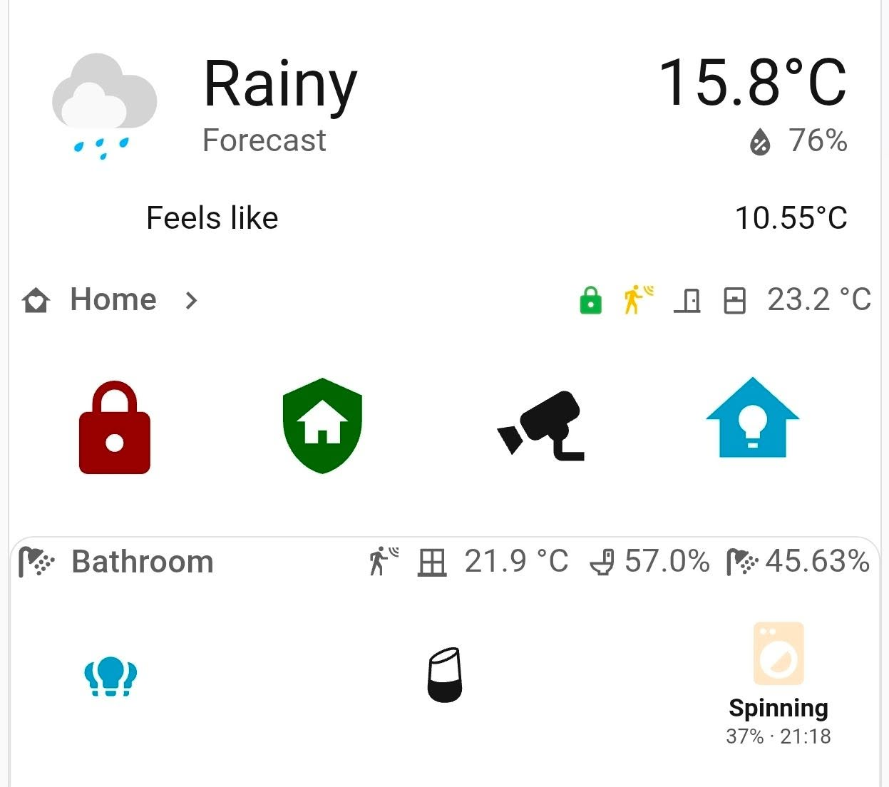
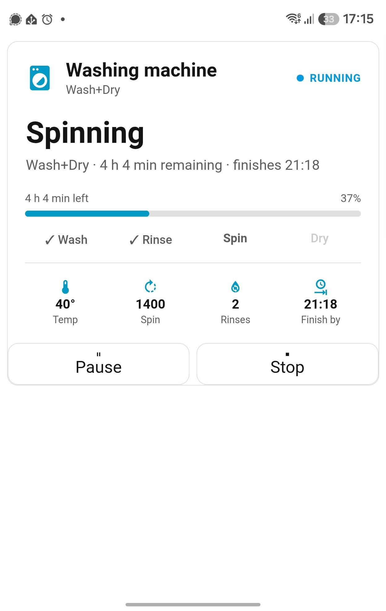
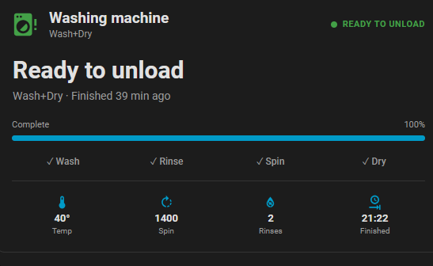

## Welcome to the samsung-washer-config wiki!

This is based purely on input from ChatGPT and with no guarantee of working with other models than the one I'm using.
The washer+dryer is integrated with [LocalThings](https://github.com/mbillow/localthings). I'm running a Samsung WD83T734CBH.

I've never uploaded to GitHub before, let me know if I mess something up. Thanks!

My washer is in HA simnply named washing_machine. Automations have to be modified to accomodate your own Notify-devices and some automations (periodic reminders) reference integrations not related to this (i.e. Waste Collection Schedule), this you have to modify yourself.
# GitHub-safe washing-machine configuration

This directory is a sanitized copy of the Home Assistant washing-machine files.
## Screenshot of example cards:

## Changes made

- Replaced personal notification targets with example entity IDs:
  - `notify.mobile_app_primary_phone`
  - `notify.mobile_app_secondary_phone`
- Replaced the personal presence entity with `person.secondary_user`.
- Replaced aliases containing personal names with `primary user` / `secondary user`.
- Replaced the live helper-state dump with `Helpers_and_sensors.yml`, containing
  YAML examples only. Exact state values and timestamps were intentionally omitted.

## Before using

Change the example notification/person entities to match your own Home Assistant
installation. If your helpers are created through the Home Assistant UI, do not
also define the same helpers in YAML.

## License

This project is licensed under the MIT License.

You are free to use, modify, and share this configuration.
See the [LICENSE](LICENSE) file for details.
